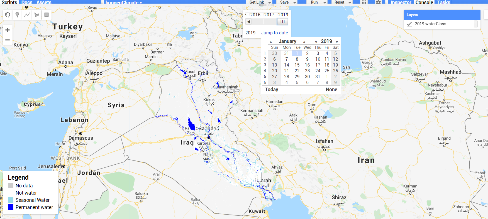

# geeFSN
 Google Earth Engine self-learning. Resources for myself. Copy the script and run in the GEE code editor: https://code.earthengine.google.com/
## 1. [Noah.js](https://github.com/fsn1995/geeFSN/blob/master/Noah.js)
This script computes, displays and exports the mean annual temperature, mean annual precipitation. Climate data is NOAH Global Land Assimulation System data. 
## 2. [grace.js](https://github.com/fsn1995/geeFSN/blob/master/grace.js)
This script displays the long term average GRACE data.
## 3. EC JRC/Google Global Product 
Explore the global surface product provided by EC JRC/Google. This part is finished while I am working as the RS and GIS associate at the ICRC.
### 3.1 [GlobalWater.js](https://github.com/fsn1995/geeFSN/blob/master/GlobalWater.js)
It would display the global surface water dynamics in your area of interest. 
  
### 3.2 [GlobalWaterAnnual.js](https://github.com/fsn1995/geeFSN/blob/master/GlobalWaterAnnual.js)
It creates a dateslider to check the annual water classification.
  
### 3.3 [GlobalUrban.js](https://github.com/fsn1995/geeFSN/blob/master/GlobalUrban.js)
This script utizes the GHSL: Global Human Settlement Layers, Built-Up Grid 1975-1990-2000-2015 (P2016) data.
  

# quick link
1) how to add a legend?
https://mygeoblog.com/2016/12/09/add-a-legend-to-to-your-gee-map/
